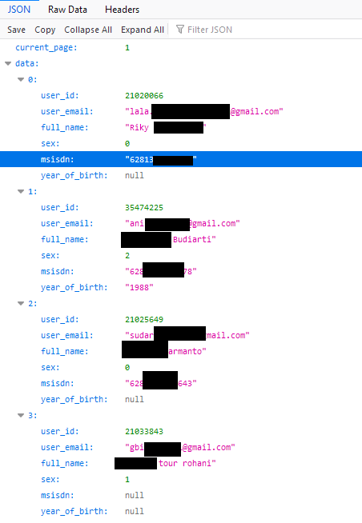

# Toko Ijo API 
***Database toko ijo yang kemaren***

Api ini dibuat untuk mempermudah sortir email sebelum dipakai untuk mass mailer.

### Fitur :
1. Search by name or email, or city
2. Search by prefix, middle number
3. Search by year of birth

### How To :
1. copy `.env.example` ke `.env`
2. edit `.env` , sesuaikan dengan database postgres milik anda yang sudah ada database toko ijo
3. composer install
4. php artisan optimize
5. php artisan serve ( url => localhost:8000 )

### API url :
GET : `{url}/api/v1/receiver`

params : 
| param  | value   | remarks / example |
|---|---|---|
| name  | string  | bisa diisi city, nama, atau apapun. ( ex: tour ) | 
| prefix   | integer   | 0856, 0813 | 
| middle  | integer  |  1234 |
| export | 1 | hasil akan diexport dalam bentuk excel |
| year | YYYY | cari tahun lahir |
| sex | boolean | 0: laki, 1: perempuan , 2: unknown |

### Screenshot
GET : `{url}/api/v1/receiver?name=tour`

### Export Example
GET : {url}/api/v1/receiver?name=tour&export=1

[result-example.xlsx](storage/images/tour.xlsx)

